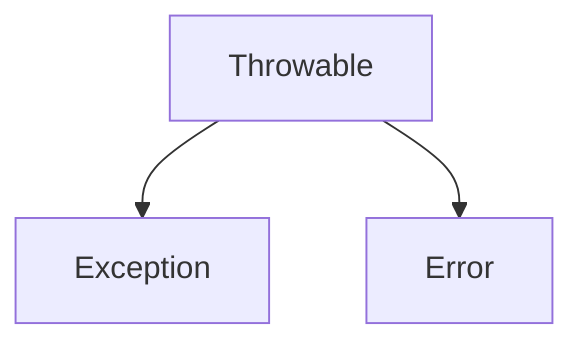
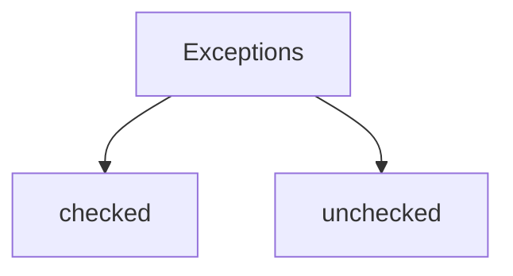

Exceptions are divided into checked and unchecked. If the method can throw a controlled type exception and does not handle it, then in the signature of the method you must specify the class the thrown exception: 

`void someMethod throws Exception`

