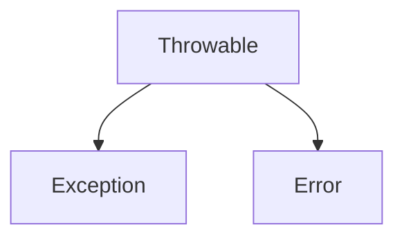

### Printf & Format

`printf("the %s jumped over the %s, %d times", "cow", "moon", 2);`

Quick summary of the available `printf` format specifiers

| Specifier | type                          |
| ---- | ---------------------------------- |
| %c   | character                          |
| %d   | decimal (integer) number (base 10) |
| %e   | exponential floating-point number  |
| %f   | floating-point number              |
| %i   | integer (base 10)                  |
| %o   | octal number (base 8)              |
| %s   | a string of characters             |
| %u   | unsigned decimal (integer) number  |
| %x   | number in hexadecimal (base 16)    |
| \%\% | print a percent sign               |
| \%   | print a percent sign               |

## Controlling integer width with printf

The `%3d` specifier is used with integers, and means a minimum width of three spaces, which, by default, will be right-justified:

| example | result |
|---|---|
| printf("%3d", 0); | 0 |
| printf("%3d", 123456789); | 123456789 |
| printf("%3d", -10); | -10 |
| printf("%3d", -123456789); | -123456789 |

Here’s a little collection of integer formatting examples

| Description                          | Code                   | Result  |
| ------------------------------------ | ---------------------- | ------- |
| At least five wide                   | printf("'%5d'", 10);   | '   10' |
| At least five-wide, left-justified   | printf("'%-5d'", 10);  | '10   ' |
| At least five-wide, zero-filled      | printf("'%05d'", 10);  | '00010' |
| At least five-wide, with a plus sign | printf("'%+5d'", 10);  | '  +10' |
| Five-wide, plus sign, left-justified | printf("'%-+5d'", 10); | '+10  ' |

Here’s a little collection of float formatting examples

| Description | Code | Result |
|---|---|---|
| Print one position after the decimal | printf("'%.1f'", 10.3456); | '10.3' |
| Two positions after the decimal | printf("'%.2f'", 10.3456); | '10.35' |
| Eight-wide, two positions after the decimal | printf("'%8.2f'", 10.3456); | '   10.35' |
| Eight-wide, four positions after the decimal | printf("'%8.4f'", 10.3456); | ' 10.3456' |
| Eight-wide, two positions after the decimal, zero-filled | printf("'%08.2f'", 10.3456); | '00010.35' |
| Eight-wide, two positions after the decimal, left-justified | printf("'%-8.2f'", 10.3456); | '10.35   ' |
| Printing a much larger number with that same format | printf("'%-8.2f'", 101234567.3456); | '101234567.35' |

